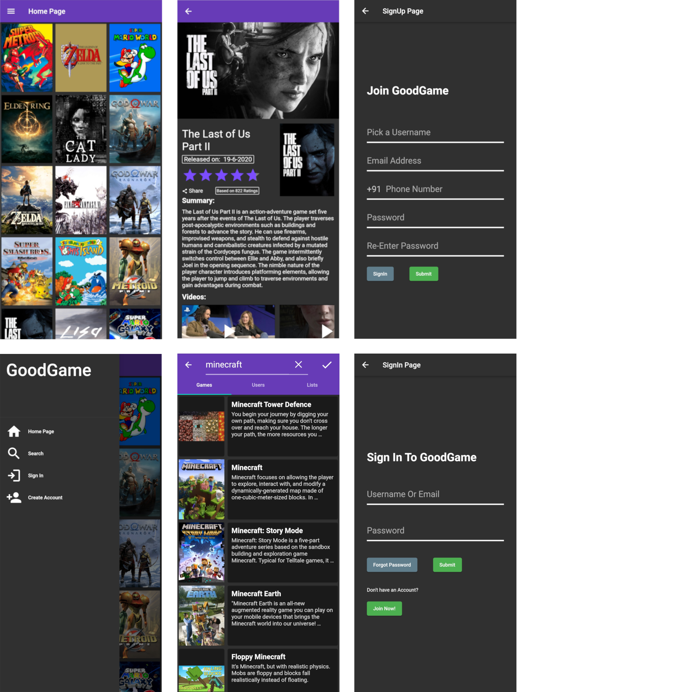

# Good Game

Android App to Browse & Discover Games
Built using Flutter, Firebase & IGDB API as a Second Year College Project

>  Planned Features:
>  Rate, Review & Log Games, Lists, Follow Friends, and Gamer Profiles.

# Requirements
1. Android Studio
2. Flutter
3. Firebase
4. IGDB
5. Android Phone
6. Development System with at least
	- 6GB RAM
	- 16GB Free Storage
	- i5/R5 CPU

# Screenshots



# Project Development Setup

## 1. Download [Flutter SDK](https://docs.flutter.dev/development/tools/sdk/releases)

## 2. Install Flutter & Dart Plugin in Android Studio

## 3. Clone Repository
```sh
git clone https://github.com/Darshil-P/good-game.git
```
## 4. Setup Firebase

### 4.1. Create a Firebase Project

#### a. FirebaseAuth
1. Add Firebase Authentication to your Firebase
2. Enable Phone Authentication
3. Add Test Numbers

#### b. FirebaseFirestore
1. Add Firebase Firestore to your Firebase
2. Modify the Rules to allow Read-Write Access
3. For Example: `allow read, write: if true;`

### 4.2. Connect your App to Firebase
1. Login
   ```sh
   firebase login
   ```
2. Configure
   ```sh
   flutterfire config
   ```
	- Select Appropriate Project
	- Select Platform as Android
3. Obtain Fingerprint
   ```sh
   cd android
   ./gradlew signingReport
   ```
	- Copy the SHA-1/256 fingerprint
	- Add them to Firebase > Project Settings > Your Apps > Add Fingerprint


## 5. Create `api_credentials.dart` File
```sh
touch lib/services/api_credentials.dart
```
Add the API credentials to this file
```dart
const IGDB_ClientID = "<client_id>";
const IGDB_ClientSecret = "<client_secret>";
const IGDB_AccessToken = "<access_token>";
```
> ToDo: Implement a Secure way of storing the API Credentials
> (Probably Firebase Remote Config)

## 6. Build App
Connect Your Phone (or use Android Studio Virtual Device)
```sh
flutter run
```
